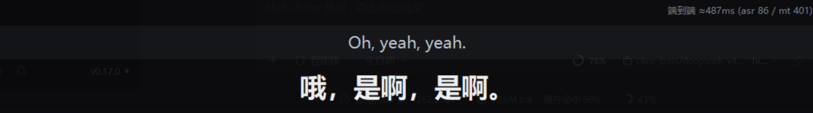

# P1 验收与测试（已通过）

> 2026-10-07 实跑通过。所有数字都是这台机器上实测的，不是估算。
> 前置：[13-P1本地部署最简方案](13-P1本地部署最简方案.md)（本地 ASR 怎么装）。

---

## 1. P1 完工定义（逐条对照）

| # | 要求 | 状态 | 证据 |
|---|---|---|---|
| 1 | 抓系统声音（视频里放什么就抓什么） | ✅ | WASAPI loopback，实测抓到 -31 dBFS |
| 2 | 语音切句（VAD） | ✅ | 纯 numpy 能量法，实时切出 8 段，无模型 |
| 3 | 语音转文字（**本地**、无 key） | ✅ | sherpa-onnx + SenseVoice int8，CPU，单句 **86ms** |
| 4 | 翻译（中英双向） | ✅ | 哔哩哔哩免费接口，无需 key，单句 **~500ms** |
| 5 | 双语字幕同屏显示 | ✅ | 桌面置顶窗 + 浏览器 overlay，见 [证据截图](../out/p1_live_overlay.png) |
| 6 | 端到端延迟 | ✅ | **487ms**（asr 86 / mt 401） |
| 7 | 时间轴 / SRT 导出 | ✅ | `out/selftest.srt` 每次运行自动重写 |
| 8 | 句子修订（rev 机制） | ✅ | 实时跑出 rev1→rev2，修正耗时 379~441ms |

**端到端实测画面**（`out/p1_live_overlay.png`，实时捕获时截的屏）：



英文原句在上、中文译文在下，右上角是引擎自己报的耗时：`端到端 ≈487ms (asr 86 / mt 401)`。

---

## 2. 怎么测试（四步，一条命令）

```powershell
cd D:\Citty
.\test-p1.ps1                 # 全跑（第 4 步需要能出声/能录音）
.\test-p1.ps1 -SkipLive       # 只跑前三步（换机器、没声卡时用）
```

实测输出：

```
[1/4] doctor ................ PASS  doctor exited 0
[2/4] file mode ............. PASS  translated 6 segment(s) / 0 errors / SRT written
[3/4] loopback probe ........ PASS  swept 2 devices, found a capturable one
[4/4] live loopback ......... PASS  translated 8 segment(s) from real audio
P1 ACCEPTANCE: PASS
```

四步分别在验什么：

| 步骤 | 验什么 | 不需要声卡 |
|---|---|---|
| 1 `doctor` | 依赖、设备、端口、翻译连通、本地模型文件在不在 | ✅ |
| 2 `file` 模式 | 拿现成音频过全链路（ASR→翻译→SRT），把"声卡问题"和"逻辑问题"分开 | ✅ |
| 3 loopback 探针 | 逐个输出设备试录，找出**能抓声音的那个**（这机器的默认设备是死流） | ⚠️ 需要设备 |
| 4 实时 | 真播音频 → 真抓 → 真转写 → 真翻译 | ❌ |

---

## 3. 用真实视频测（真正的验收场景）

```powershell
# ① 先把系统默认输出设备切到**能被抓的那个**（否则录到静音）
#    Windows 设置 → 系统 → 声音 → 输出 → 选「扬声器 (网易虚拟音频设备)」
#    或者：先跑探针确认哪个能用
D:\Citty\.venv\Scripts\python.exe tools\probe_loopback.py --sweep

# ② 起引擎 + 桌面置顶字幕窗（两个窗口）
.\demo.ps1

# ③ 打开 B 站 / YouTube 播任意英文视频 —— 字幕应该跟着出来
#    浏览器 overlay（给 OBS 用）：http://127.0.0.1:8756/overlay
#    状态：http://127.0.0.1:8756/api/status
```

方向切换：中文字幕用默认档；想看**中文视频 → 英文字幕**：

```powershell
D:\Citty\apps\engine 下：
python -m citty.cli -c D:\Citty\config.local.yaml -o mt.target_lang=en selftest --seconds 30
```

不出声也能验证"显示层"（用浏览器 overlay + mock 语音）：

```powershell
.\run.ps1 selftest 20          # 云端/mock 档，不需要声卡
.\demo.ps1 -Config D:\Citty\config.yaml -Source mock
```

---

## 4. 实测数据汇总

| 指标 | 结果 | 出处 |
|---|---|---|
| 端到端单句延迟 | **487ms**（ASR 86 / MT 401） | 实时截图 |
| 本地 ASR（5 秒片段，CPU，8 线程） | **110ms**，RTF **0.022** | [13](13-P1本地部署最简方案.md) |
| 本地 ASR（中文样例准确率） | **CER 0.0**（与人工参考完全一致） | 同上 |
| ASR 模型载入 | 0.92~1.2s（`warmup: true` 启动时做掉） | 同上 |
| 翻译（哔哩哔哩免费） | 544~642ms / 句 | 本次运行 |
| 切句悬崖 | **13.5s** 之后 CPU 成本跳 5 倍 → 保持 ≤12s | 同上 |
| 实时链路连续性 | 40 秒里 8 段全中，0 丢弃 0 报错，rev 修订正常 | 本次运行 |
| 模型总下载 | **228.5 MB**（唯一一个） | `models/sensevoice-onnx/` |
| 显存占用 | **0** | CPU 推理 |

---

## 5. 排障表（都是这次真踩到的）

| 现象 | 真因 | 处理 |
|---|---|---|
| 中文控制台下引擎**直接崩**：`UnicodeEncodeError: 'gbk' codec can't encode character '\u25b8'`，一次 6 段全变 `PIPELINE_FAILED` | 输出里的 `▸ ✅ ❌` 在 cp936(GBK) 里**没有码位**，Python 默认 strict 编码 → 打印状态就把整条流水线搞崩 | 已在 `citty/__init__.py` 里 `reconfigure(errors="replace")` 兜住（**不强制 UTF-8**，否则往 GBK 控制台写 UTF-8 会让中文全乱码）。现在最多把 `▸` 显示成 `?` |
| 录到一片静音（-180 dBFS，峰值 0.000） | **默认输出设备是死流**（这台机器默认 = Senary Audio，它的 loopback 抓不到东西） | `probe_loopback.py --sweep` 找可用设备 → 写进 `config.local.yaml` 的 `audio.device` |
| `Start-Process` 抛"字典中的关键字 HTTP_PROXY 已添加" | 环境里同时存在 `http_proxy` 和 `HTTP_PROXY`（大小写重复），PowerShell 用它建大小写不敏感的字典就崩 | `demo.ps1` / `test-p1.ps1` 开头先删掉小写那几个；`Get-ChildItem Env:` 也会因此失败，改用 `[System.Environment]::GetEnvironmentVariables()` |
| 引擎在构造 HTTP 客户端时就崩：`InvalidURL: Invalid port: ':1]'` | `NO_PROXY` 里的 `[::1]` 被 httpx 解析失败 | 已内置兜底（`citty/net.py`），`doctor` 会显示这一项 |
| 日志里的中文变成乱码（`浣嗕粬`） | PowerShell 的 `>` 重定向用控制台代码页解码子进程的 UTF-8，再重新编码一遍 | 重定向走 `cmd /c "... > log"`（字节级拷贝），或直接用 Python 写文件 |
| 实时跑不出任何字幕 | 播放器把声音送到了**别的**设备 | 让视频/播放器的输出走那个可抓的设备（系统默认输出切过去最省事） |
| 字幕比视频慢一拍 | 模型首次载入 | 保持 `asr.local.warmup: true` |

---

## 6. 还没覆盖的（别误以为已经全好了）

1. **真人实景**：目前用官方样例音频（英文访谈 15s）验证。你拿真实 B 站/YouTube 视频跑一遍才算最终验收。
2. **长视频连续跑**：只测了 40 秒。连续 1 小时的内存/连接稳定性没测过。
3. **口音/音乐/多人抢话**：VAD 是能量法，背景音乐大到人声电平附近会切错句。
4. **P2 配音的口型同步**：还没做（`edge-tts` 已验证可用，见 [10](10-免费方案与最小部署.md)）。
5. **P3/P4**：路由与多语种选型已完成，接线未做。
